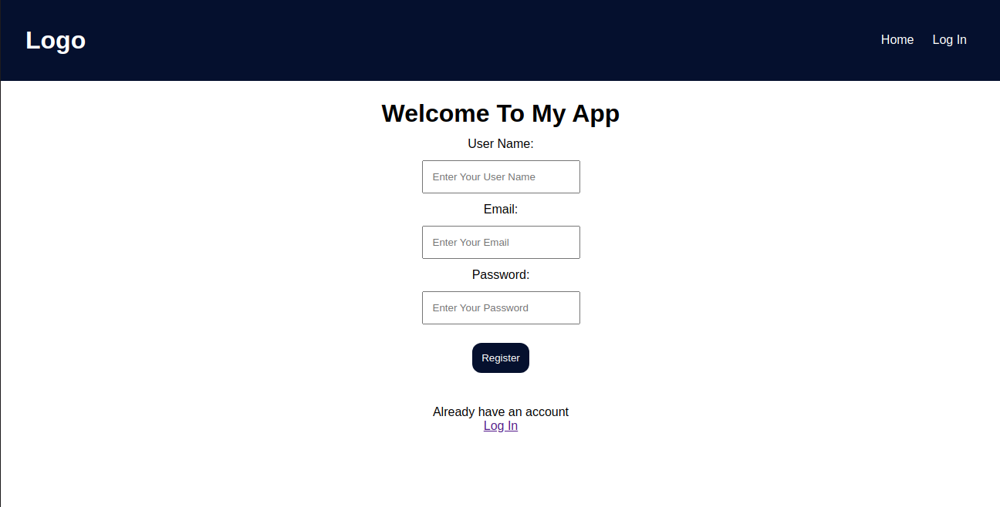
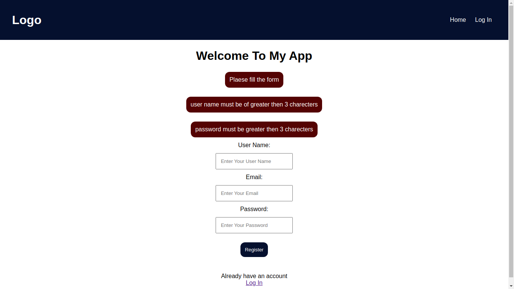
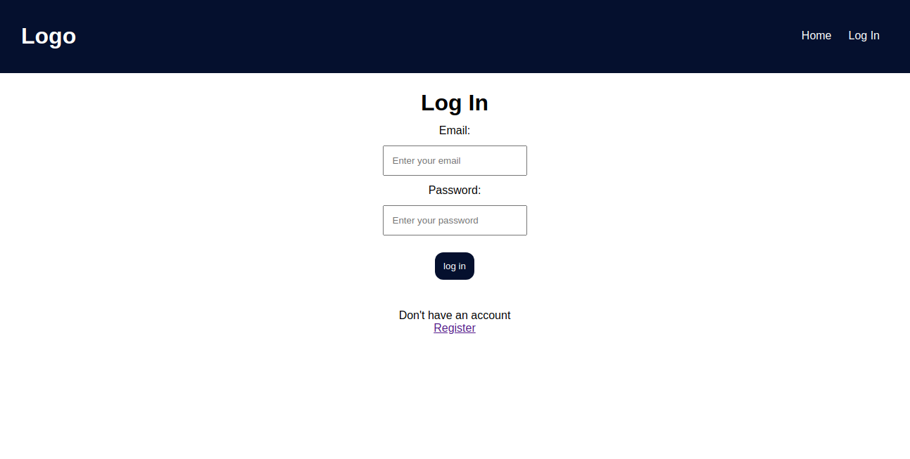
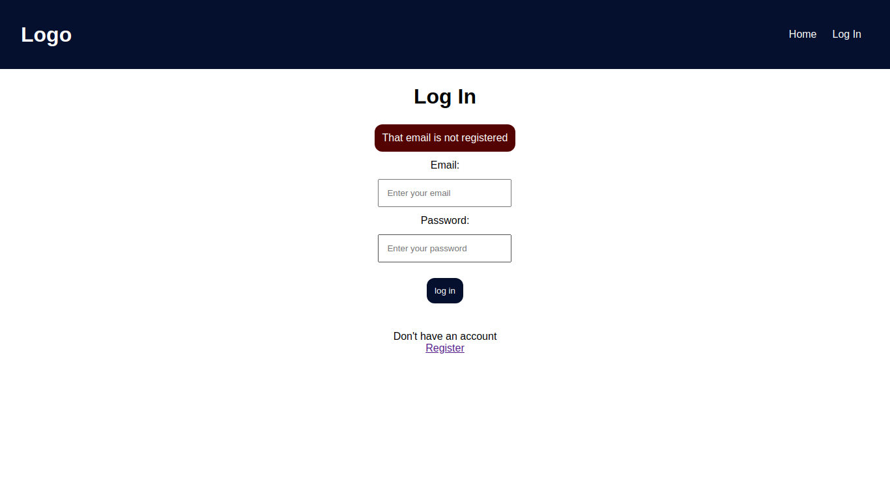
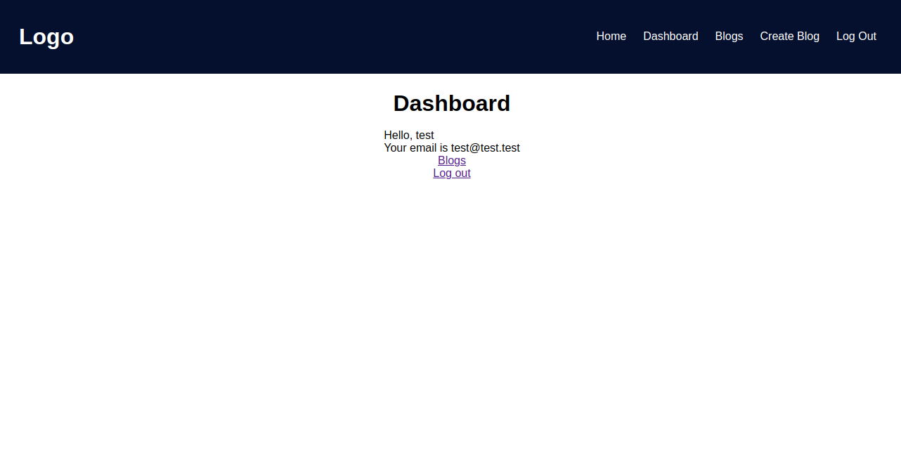
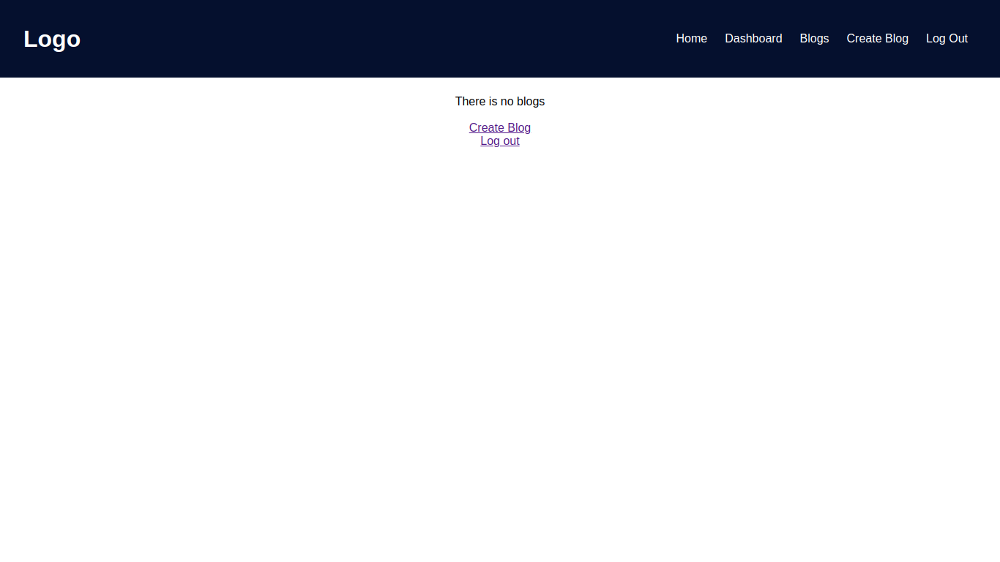
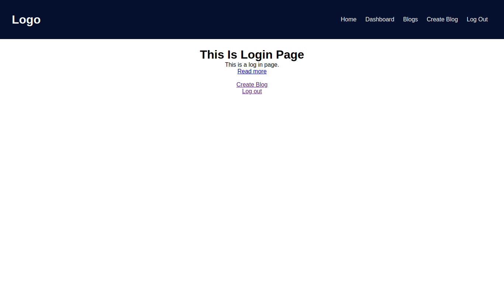
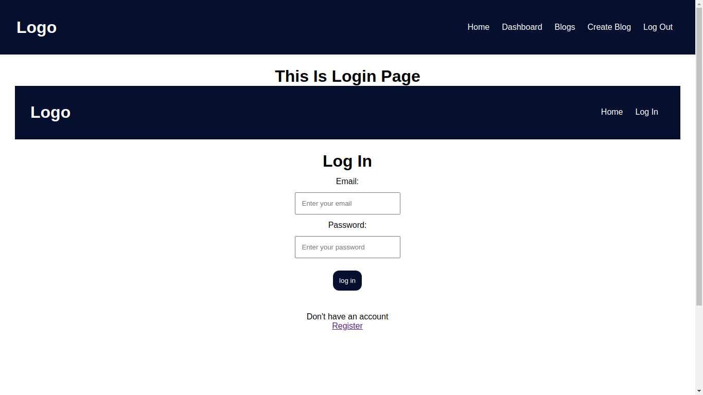

# Blog website 📝

This is a blog website. There is two ways to access blogs by server and nextjs. Server is only for **Admin** of server. On client side, Users or readers will access blogs.

## Features

You can `create blog`, `delete blog`, `see blog` and `show blogs to users`.

## Screen shots:

<video width="320" height="240" controls>
    <source src="./screenShots/showing-app.mp4">
    Your browser does not support the video tag.
</video>

## willing to contribute 🙋  ?

please open an [issue](https://github.com/vivek80801/blog-site/issues "Go to issue tab")
check [CODE_OF_CONDUCT.md](https://github.com/vivek80801/blog-site/blob/master/CONTRIBUTING.md "GO to CODE_OF_CONDUCT.md") and [CONTRIBUTING.md](https://github.com/vivek80801/blog-site/blob/master/CONTRIBUTING.md "GO to CONTRIBUTING.md")
